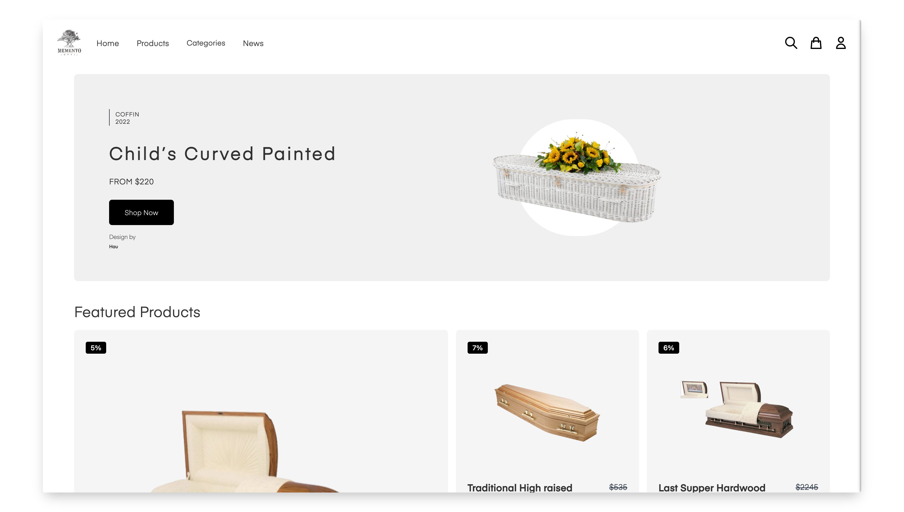
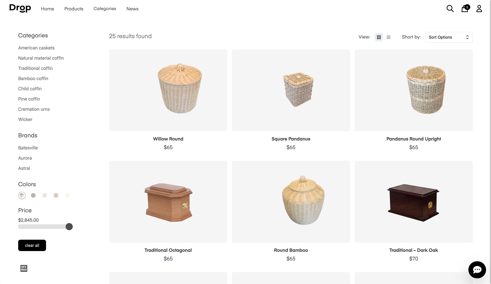

# Coffin E-commerce
Coffin store where peoples can purchase their coffin when near death

<a href="https://coffin-ecommerce.vercel.app/">Visit the live app</a>




## Technologies
1. Next.js (React.js)
2. SASS and Tailwind (Styling)
3. Typescript (Statically Checked Types)

## Work In Progress
The app is being under maintenance, as more work needs to be done.

Current functionality includes:
- Sign In, Register (register currently only works on dev )
- Add or Remove item/items from cart
- Responsive design (mobile, ipad, desktop)
- Payments with Stripe (Testing Mode)

## Known Bugs
Feel free to email me at lakshman.gope2@gmail.com if you run into any issues or have questions, ideas or concerns. Please enjoy
and feel free to share your opinion, constructive criticism, or comments about my work. Thank you! 🙂

## Future Updates

- Product Page
- Improve overall UX/UI and fix bugs
- Featured Products
- Admin dashboard manage CRUD users/products
- Recently Viewed Products

And More ! There's always room for improvement!

## Installation
Install deps:
```bash
yarn
```

Run Next dev server:
```bash
yarn dev
```


## Deployed Version
Feel free to visit 👉 https://coffin-ecommerce.vercel.app/

